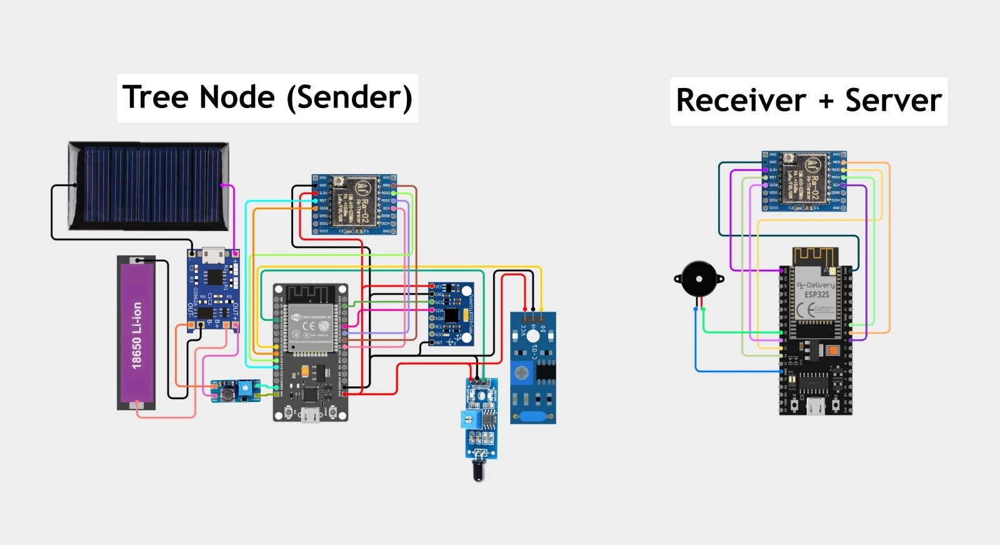
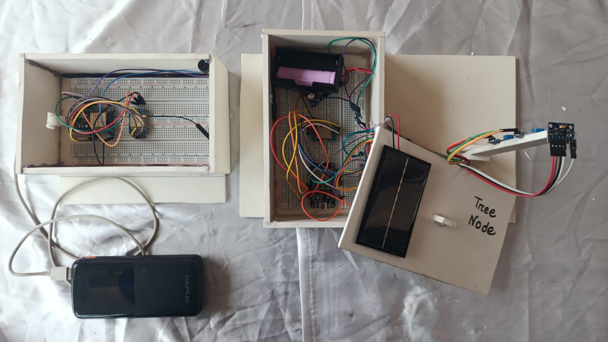

# 🌳 EnviroSense
### Smart Forest Protection and Monitoring System using ESP32 and LoRa

EnviroSense is an IoT-based smart forest monitoring system designed to detect illegal tree cutting, forest fires, and tree falls caused by natural disasters. The system provides real-time alerts to the responsible authorities through a long-range LoRa communication network and a web-based monitoring dashboard.

The project consists of two main nodes:

1. **Tree Node (Sender)** – Installed on individual trees to monitor their condition.
2. **Authority Node (Receiver + Server)** – Receives alerts, activates an alarm, and hosts a monitoring dashboard.

---

## 📌 Project Objective

Illegal tree cutting and forest fires are major threats to forest ecosystems. Traditional monitoring methods often fail to provide immediate notifications.

EnviroSense aims to:

- Detect tree cutting attempts.
- Differentiate between human-caused cutting and storm-induced tree falls.
- Detect nearby fire incidents.
- Send real-time alerts using LoRa communication.
- Provide a web dashboard for forest authorities.
- Enable rapid response to environmental threats.

---

# 🏗 System Architecture

## Tree Node (Sender)

The Tree Node continuously monitors the tree using multiple sensors.

### Components Used

- ESP32
- LoRa Ra-02 Module
- MPU6050 Gyroscope & Accelerometer
- SW420 Vibration Sensor
- IR Flame Sensor
- Solar Panel
- 18650 Li-ion Battery
- TP4056 Charging Module
- DC-DC Buck Converter

### Responsibilities

- Monitor tree orientation and movement.
- Detect vibrations caused by cutting activities.
- Detect nearby fire incidents.
- Analyze sensor data.
- Send alerts via LoRa.

---

## Authority Node (Receiver + Server)

The Authority Node receives data from Tree Nodes and acts as a monitoring station.

### Components Used

- ESP32
- LoRa Ra-02 Module
- Buzzer

### Responsibilities

- Receive alerts from Tree Nodes.
- Trigger an audible alarm.
- Host a web dashboard.
- Display tree status in real time.
- Allow authorities to acknowledge incidents.

---

# 🔍 Detection Logic

EnviroSense uses sensor fusion to determine the cause of an incident.

## Human Tree Cutting Detection

Indicators:

- Strong vibration detected by SW420.
- Significant tree tilt detected by MPU6050.

When these events occur together, the system classifies the event as:

**Tree Cutting Detected**

---

## Storm Fall Detection

Indicators:

- Significant tree tilt detected.
- No cutting vibration pattern detected.

The system classifies the event as:

**Tree Fallen Due to Storm**

---

## Fire Detection

Indicator:

- Flame sensor threshold exceeded.

The system immediately sends:

**Fire Alert**

---

# 📡 Communication

The project uses LoRa (433 MHz) communication.

### Advantages

- Long communication range
- Low power consumption
- Reliable outdoor operation
- Suitable for remote forest environments

Communication Flow:

Tree Node → LoRa → Authority Node → Dashboard + Alarm

---

# 🌐 Web Dashboard

The Authority Node hosts a web server directly on the ESP32.

The dashboard provides:

- Real-time tree status
- Fire alerts
- Tree cutting alerts
- Storm fall alerts
- Incident acknowledgment
- Status updates after action is taken

### Dashboard Preview

`Web_Dashboard.jpg`

---

# 🔋 Power Management

The Tree Node is designed for long-term outdoor deployment.

Power System:

- Solar Panel
- TP4056 Charging Circuit
- 18650 Li-ion Battery
- DC-DC Converter

This enables continuous operation with minimal maintenance.

---

# 📁 Project Structure

```text
EnviroSense/
│
├── Final_Sender_Part/
│   └── Final_Sender_Part.ino
│
├── Final_Receiver_Part/
│   └── Final_Receiver_Part.ino
│
├── Circuit_Diagram.jpeg
├── Real_Life_Implemented_Circuit.jpeg
├── Web_Dashboard.jpg
│
├── LICENSE
└── README.md
```

---

# 🔌 Circuit Diagram

### Complete System Wiring



---

# 🛠 Real Life Implementation



---

# 📊 Sensor Overview

| Sensor | Purpose |
|----------|----------|
| MPU6050 | Detect tree tilt and orientation |
| SW420 | Detect vibration caused by cutting |
| IR Flame Sensor | Detect nearby fire |
| LoRa Ra-02 | Long-range wireless communication |

---

# ⚙️ Software Stack

### Tree Node

- Arduino Framework
- ESP32
- LoRa Library
- Wire Library
- MPU6050 Library

### Authority Node

- Arduino Framework
- ESP32 Web Server
- LoRa Library

---

# 🚨 Alert Types

| Alert | Description |
|---------|-------------|
| Healthy | Normal tree condition |
| Cutting Detected | Possible illegal tree cutting |
| Fallen in Storm | Tree fall caused by natural events |
| Fire Detected | Fire detected near tree |

---

# 🚀 Future Improvements

- GPS location tracking
- GSM/SMS notifications
- Mobile application
- Cloud database integration
- Multiple tree node deployment
- Solar power optimization
- AI-based event classification

---

# 👨‍💻 Team Members

- Mahadi Alam Shahib
- Tahmid Ibne Mofazzol
- Arghya Deb Sikder

---

# 📄 License

This project is licensed under the MIT License.

See the [LICENSE](LICENSE) file for details.

---

## 💚 EnviroSense

**Protecting Forests Through Smart Technology**